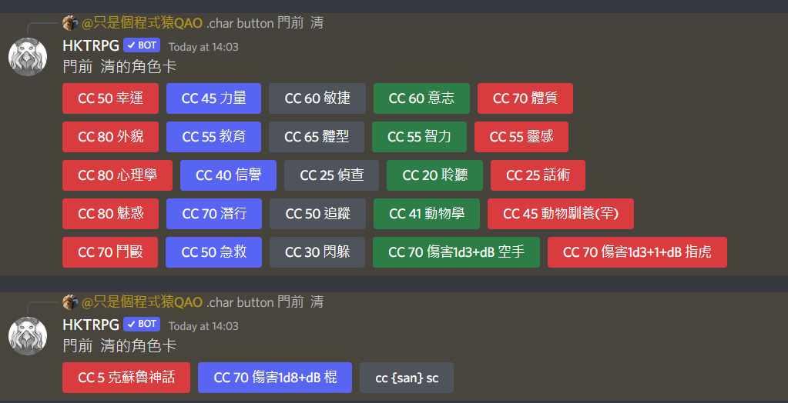

# Character Sheet


**Tip:** The web character sheet can link to chat apps — roll on the web and results appear in the app.


### 1. Add a character sheet

You need a chat account linked to HKTRPG. Add a sheet with a command like this (adjust fields to your character):\
**`.char add name[Sad or your name]~`** \
**`state[HP:15/15;MP:10/10;San:80]~`** \
**`roll[鬥毆: cc 50;sc:cc {san};]~`** \
**`notes[筆記:這是測試,請試試在群組輸入 .char use Sad或你想要的名字;]~`**

\
A **add/update success** message means the sheet was saved.

 (1).png>)

### 2. Edit a character sheet


Note: editing here usually means adding fixed fields or stats —\
e.g. Strength, Intelligence, or custom abilities —\
not applying −1 HP after damage (use `.ch` for that in play).


After adding a sheet, you can keep editing in chat.\
The format matches `add`; the web UI is often easier for visual editing. 

### i) Edit on the web

**To use the web editor, create an admin account first.**

 (1).png>)

Type **`.admin account (username) (password)`**

Then open the [`Character Sheet Manager`](https://card.hktrpg.com/)

Log in on the site to manage and edit your sheets.

 (1).png>).png>)

Change values and click **Save character sheet** (top right).

### ii) Edit in chat

Text editing uses the same format as `add`.\
Format:\
**`.char edit`** \
**`name[Sad or your name]~`** \
**`state[HP:15/15;MP:10/10;San:80]~`** \
**`roll[鬥毆: cc 50;sc:cc {san};]~`** \
**`notes[筆記:這是測試,請試試在群組輸入 .char use Sad或你想要的名字;]~`**

### 3. Use a character sheet

When the sheet is ready, activate it in the channel where you play:

`.char use character_name`

Example: **`.char use Sad or your name`**

 (1).png>)

Then use `.ch` commands in that channel.

To send web rolls to registered Discord, Telegram, or LINE groups:

* Admin runs `.admin allowrolling` to authorize the group
* Register the group: `.admin registerChannel`
* Revoke: `.admin disallowrolling`
* Unregister: `.admin unregisterChannel`

The site then lists group names — click one to link rolls.

### Alternative — Button UI (Discord only)

#### Usage

**`.ch button`** or\
**`.char button character_name`** — generate sheet buttons

The two variants produce different button behavior: the former uses **`.ch`**; the latter runs rolls directly.

 


Buttons from `.char button` do not support `{}` placeholders — `{San}` will not work.

`{}` is a `.ch` feature that reads the active sheet registered via `.char use`.



After buttons are posted, right-click and Pin them so you can find your sheet quickly.


### Command Reference

#### `.char`

`.char add name[Sad]~ state[HP:15/15;con:60;san:60]~` \
`roll[鬥毆: cc 50;投擲: cc 15;sc:cc {san}]~` \
`notes[筆記:這是測試,請試試在群組輸入 .char use Sad;]~`

**Add or update a character sheet**

`.char Show` — **list character sheets**

`.char Show0` — **show sheet #0 (replace 0 with another index)**

`.char edit name[sheet_name]~` — **edit a sheet using the add format**

`.char use sheet_name` — **activate a sheet in this group**

`.char nonuse` — **deactivate the sheet in this group**

`.char delete sheet_name` — **delete a sheet**

`.char button sheet_name` — **Discord only — generate roll buttons**

#### `.ch` commands

After `.char use (name)` in a group, sheet commands are available.

`.ch field_name field_name` — **show value or roll if no math**

`.ch field_name (number)` — **set e.g. HP to that number**

`.ch field_name (+-/_number)` — **apply arithmetic to e.g. HP**

`.ch field_name (+-/_xDy)` — **apply dice arithmetic to e.g. HP**

`.ch set field_name new_content` — **replace field content**

`.ch show` — **show state and roll sections**

`.ch showall` — **show entire sheet**

`.ch button` — **Discord only — generate roll buttons**

## Expressions

### state

Stores numeric fields that support math, e.g. `.ch HP +3`, `.ch HP +1d3`.

### roll

Stores roll commands for quick use, e.g. `.ch 空手鬥毆`.\
Avoid spaces in roll entry names.

#### `{}` placeholders

Reference `state` values, e.g. `{db}` becomes 1d3.\
Simple math works: `1+{HP}` → `1+15 -> 16`.

`<>` expressions

Used for **basic**, **advanced**, and **CoC** rolling.\
Supports longer commands;\
hides intermediate steps and uses the final numeric result only.\
`<1d3>` → 2\
`<.sc san 1/1d5>` normally prints `現在San值是x點`, so the result is x, not 1 or 1d5.

### notes

Stored text you can read later, e.g. `.ch 筆記`.

## Examples

`.ch set 護甲 3`                  — set armor to 3\
`.ch hp 10`                             — set HP to 10\
`.ch HP +3 MP 6 san -10 筆記` — HP +3, MP 6, San −10, show notes\
`.ch HP +3d6`                        — HP +3d6\
`.ch san -<1d3>`                 — San −1d3\
`.ch san <.sc san 1/1d3>`  — San check\
.png>)\
`.ch str <3D6dl2>`               — set STR to 3d6dl2\
`.ch hp *3/2`                           — HP ×3÷2\
\
`.ch 鬥毆`                                  — brawl roll\
`.ch san`                                   — show current San\
`dr .ch 魔法`                           — secret roll\
\
 

