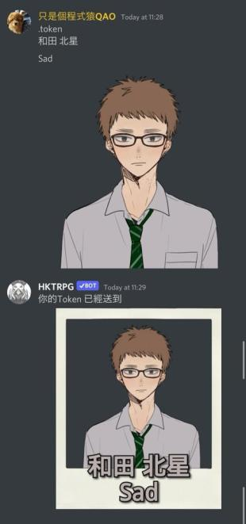

# TRPG Token Maker

**`.token(2-3) [name line 1] [name line 2]` — create a TRPG Token**

**`.tokenupload` — upload a Token to imgbox**

**Discord only**\
This feature creates session tokens for play.\
You can customize two lines of text and the image content.\


### How to Use

Reply to a message with an image, or send an image, then type `.token` or `.token2` to create a Token.\
If there is no image, your avatar is used as the token.\
You can also enter two lines of text for the name on the image, for example:

```
.token
Sad
HKTRPG
```

You can leave the text blank — the Token will have no text.

### Styles


Only these three formats are available for now. If you are creative or can draw, feel free to submit designs to expand this feature.


`.token` — instant-photo style\
`.token2` — round transparent Token\
`.token3` — Token with a random border color based on the name you enter

 (1) (2).png>)

\
<br>

<div align="left"><figure><figcaption></figcaption></figure></div>


### .tokenupload

<div align="left"><figure><figcaption><p>Credit: <a href="https://en.wikipedia.org/wiki/Cat#/media/File:Cat_August_2010-4.jpg">https://en.wikipedia.org/wiki/Cat#/media/File:Cat_August_2010-4.jpg</a></p></figcaption></figure></div>

Reply to a message and type `.tokenupload` to upload the image to imgbox —\
handy for FVTT.


