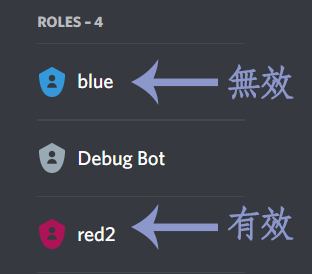

# Discord Role Management


The new version uses a designated message for management.\
Previously, HKTRPG added its own message content, which made editing inconvenient.


When users click reaction emojis (such as 😀😃😄) on a designated message,\
they are **assigned the corresponding role**.

* Note: HKTRPG needs **Manage Roles** and **Add Reactions** permissions. Please grant them.
* Users also need **Manage Server** permission.

### Tutorial

#### Enable **Developer Mode**

Go to **User Settings** => **Advanced** => enable **Developer Mode**.\
This lets you **Copy ID**.

#### **Copy Role ID**

Go to **Server Settings** => **Roles** => **Create** or **configure** the **role** you want to assign.\
Right-click the role and choose **Copy ID**, then save that **ID**.

#### Post a Message and Copy Message ID

Post a message in any channel explaining that reacting will grant a role.\
Right-click that message and choose **Copy ID**, then save that ID.

**Example** \
React with 🎨 to get the Artist role \
React with 😁 to get the Laughing role

#### Enter the Command

Finally, enter the command in the following format, filling in the IDs you saved:

`.roleReact add`\
`RoleID Emoji`\
`[[messageID]]`\
`Message ID of the posted message`

#### **Example**

`.roleReact add`\
`232312882291231263 🎨`\
`123123478897792323 😁`\
`[[messageID]]`\
`12312347889779233`


Note: You can enter the same message ID again to add more emojis.


### Command List

* `.roleReact add` — Add a designated message
* `.roleReact show` — Show data for existing designated messages
* `.roleReact delete (number)` — After deletion, that message will no longer assign or remove roles

### FAQ

#### Q1: I tried to assign a role, but nothing happens when someone clicks the reaction?

There can be many causes, but insufficient permissions is the most common.\
Discord has strict permission protection. Check whether HKTRPG has permission to manage roles. If it already does or is Admin,\
check whether the role you want to assign is **above** HKTRPG in the **Roles** list.\
In that case, even with Admin, HKTRPG cannot assign that role to others.\
You need to move HKTRPG higher than those roles.

 
