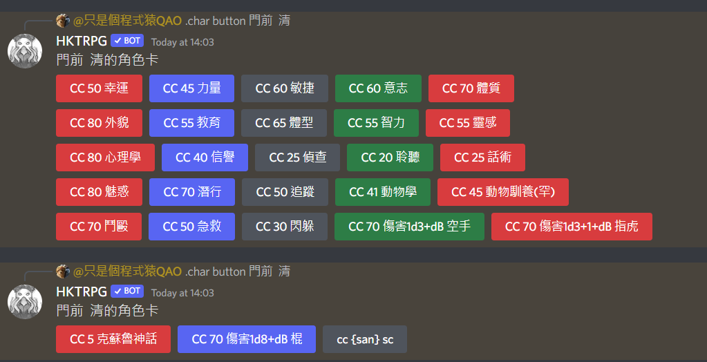

# 角色卡


**小知識:** 網頁版角色卡功能可以連動聊天軟件，在網頁上擲骰，結果可以直接出現在軟件上。


### 1. 新增角色卡&#x20;

使用的第一步，是需要你擁有聊天軟件的帳號，然後對HKTRPG輸入以下的新增指令(或按以下格式輸入自己的角色卡)\
**`.char add name[Sad或你想要的名字]~`** \
**`state[HP:15/15;MP:10/10;San:80]~`** \
**`roll[鬥毆: cc 50;sc:cc {san};]~`** \
**`notes[筆記:這是測試,請試試在群組輸入 .char use Sad或你想要的名字;]~`**&#x20;

\
彈出**新增/修改成功**代表你已經新增角色卡

 (1).png>)

### 2. 編輯角色卡


注: 這裡的編輯通常是指新增一些固定會出現的數值/欄位，\
例如力量，智力，星爆氣流斬等角色的能力，屬性，\
而不是你被扣了1血，就用這個方式去扣血。


新增角色卡後，你可以繼續在聊天軟件上編輯角色卡內容，\
修改角色卡的格式和新增角色卡一樣，\
但比較方便的方法還是以網頁的方式，以可視化的方式修改。\

### i) 網頁上編輯角色卡

**而為了使用網頁版角色卡，你需要新增管理用的帳號**

 (1).png>)

輸入 **`.admin account (username) (password)`**&#x20;

然後進入 [`角色卡管理庫`](https://www.hktrpg.com:20721/card/)

在網頁 輸入帳號密碼， 就可以管理你的角色卡，進行修改。

 (1).png>).png>)

想修改內容，只要直接修改數字然後按右上角的儲存角色卡就可以了。

### ii) 聊天軟件上編輯角色卡

文字式的編輯角色卡，與新增角色卡一樣。

格式\
**`.char edit`** \
**`name[Sad或你想要的名字]~`** \
**`state[HP:15/15;MP:10/10;San:80]~`** \
**`roll[鬥毆: cc 50;sc:cc {san};]~`** \
**`notes[筆記:這是測試,請試試在群組輸入 .char use Sad或你想要的名字;]~`**

### **`3. 使用角色卡`**

現在你已經把角色卡準備好，就可以正式使用。

方法很簡單，只要你在需要使用角色的頻道裡輸入

`.char use 角色卡名字 就可以了`

`如上面就輸入 .char use`` `**`Sad或你想要的名字`**

 (1).png>)

接著，就可以在該頻道使用

把結果傳送到已登記的Discord，TG，LINE上的聊天群組的登記方法:&#x20;

由該群組的Admin授權允許 輸入 .admin allowrolling\
登記該群組到自己的名單中 輸入 .admin registerChannel\
取消方法 由該群組的Admin取消授權 輸入 .admin disallowrolling\
取消登記該群組到名單 輸入 .admin unregisterChannel

最後網站會顯示群組名稱，點擊就可以使用了

### 另一種使用方式 - Button 按鈕化 - Discord 限定

#### 使用方式

**`.ch button`**  或\
**`.char button 角色名字`** 可以產生你的角色卡按鈕

兩種產生的按鈕指令會有所不同，前者調用**`.ch`**後者產生直接擲骰的指令

&#x20;


.char button 產生的角色卡不支援 {}功能，所以 {San}無效

因為 {} 是.ch 的技術 讀取.ch裡註冊了的角色卡



按鈕產生後，可以按右鍵點擊Pin，方便自己擲骰時可以找到角色卡位置


### 功能一覧

#### `.char`

`.char add name[Sad]~ state[HP:15/15;con:60;san:60]~` \
`roll[鬥毆: cc 50;投擲: cc 15;sc:cc {san}]~` \
`notes[筆記:這是測試,請試試在群組輸入 .char use Sad;]~`&#x20;

**可以新增及更新角色卡**

`.char Show` - **可以顯示角色卡列表**&#x20;

`.char Show0` - **可以顯示0號角色卡內容 0可以用其他數字取代**&#x20;

`.char edit name[角色卡名字]~` - **可以以add的格式修改指定角色卡**

`.char use 角色卡名字` - **可以在該群組中使用指定角色卡**&#x20;

`.char nonuse` - **可以在該群組中取消使用角色卡**&#x20;

`.char delete 角色卡名字` - **可以刪除指定角色卡**

`.char button 角色卡名字` - **Discord限定，產生擲骰按鈕**

#### `.ch 功能`

在群組中使用.char use (角色名) 後, 就可以啟動角色卡功能

`.ch 項目名稱 項目名稱` - **沒有加減的話, 會單純顯示數據或擲骰**&#x20;

`.ch 項目名稱 (數字)` - **可以立即把如HP變成該數字**&#x20;

`.ch 項目名稱 (+-`_`/數字)` - **可以立即對如HP進行四則運算**_

_`.ch 項目名稱 (+-`_`/xDy)` - **可以對如HP進行擲骰四則運算**&#x20;

`.ch set 項目名稱 新內容` - **直接更改內容**&#x20;

`.ch show` - **顯示角色卡的state 和roll 內容**&#x20;

`.ch showall` - **顯示角色卡的所有內容**

`.ch button` - **Discord限定，產生擲骰按鈕**

## 運算式

### state&#x20;

這是用來儲存浮動數據, 進行運算 如: `.ch HP +3`

### roll&#x20;

這是用來儲存擲骰指令, 快速使用 如 `.ch 空手鬥毆`\
注意項目名稱請不要有空格

#### {}符號

這可以用來指定state 的參數, 如`{db}`就會變成 1d3\
可以進行簡單運算 如`1+{HP}` 就會變成 `1+15 -> 16`

`<>`符號

這個可以用來進行**基本擲骰**，**進階擲骰**及**COC擲骰**的運算，\
它不會顯示過程，只會取得運算後的最後一個數字\
<1d3>  -> 2\
<.sc {san} 1/1d5> 的本來顯示結果是`現在San值是x點`\
所以結果是x，而不是1或1d5

### notes&#x20;

這是用來儲存數據, 以後可以查看 如 `.ch 筆記`

## 使用範例

.ch set 護甲 3\
.ch hp 10\
.ch HP +3 MP 6 san -10 筆記\
.ch HP +3d6 \
.ch hp \*3/2 .ch 鬥毆\
.ch san \
dr .ch 魔法\
.ch str <3D6dl2>\
.ch san -<1d3>\
.ch san <.sc san 1/1d3>

