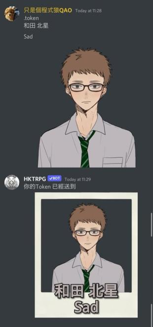

# Token製作功能

**Discord 限定**\
這是用來製作跑團Token的功能\
可以自定兩行名字和圖片內容 \


### 使用方法

Reply一個有圖片的訊息 或傳送一張圖片時，輸入指令.token 或 .token2 就可以製作Token\
沒有圖片的話，會使用你的頭像，作為token\
亦可以輸入兩行文字，作為圖片上的名字 如

```
.token
Sad
HKTRPG
```

也可以不輸入，那Token上就不會有文字

### 樣式

`.token` 是一張即影即有相片 \
`.token2` 是一張圓型透明Token&#x20;

.png>)\
\


### &#x20;現在只有這兩款格式，歡迎有創意/會畫畫的人，提供圖樣， 豐富這功能
