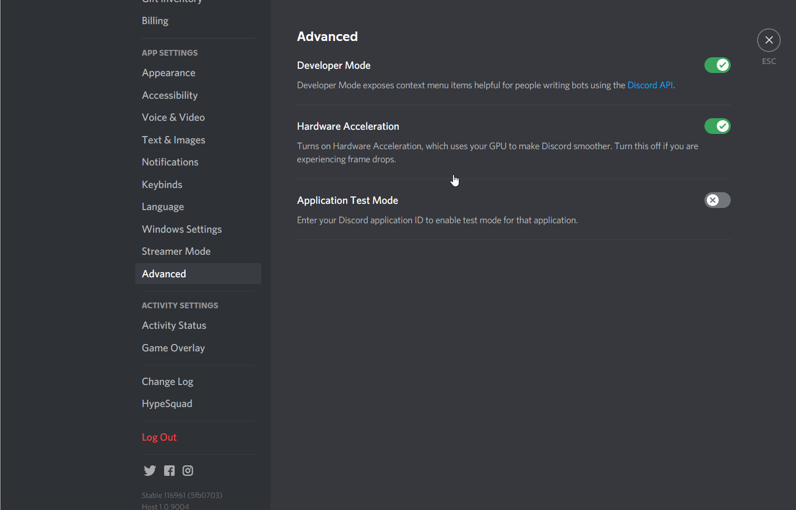

# Discord身分組管理


新版本改為使用指定的訊息來管理 \
過去由HKTRPG增加信息，變相不能再修改內容，有點麻煩


讓對指定訊息的Reaction Emoji(如😀😃😄)進行點擊的用家\
**分配指定的身分組別**

* 注意: 此功能需求HKTRPG擁有【編輯身分組】及【增加Reaction】的權限，請確定授權。
* 另外，使用者需要【伺服器管理者】權限。

### 使用教學

#### 開啓**Developer Mode**

首先去**User Setting**=>**Advanced**=>開啓**Developer Mode**\
****這會令你可以COPY ID

#### **複製身分組ID**

再去**Server Setting**=>**Roles**=>**新增**或**設定**希望分配的**身分組**\
****然後對該身分組按右鍵並按**COPY ID**，把該**ID**記下來

#### 發佈信息及複製信息ID

接著，去任意頻道中發佈一段信息，表示如果按了React 就會得到身份組，\
並對該信息按右鍵再按COPY ID，把該ID記下

**範例** \
按🎨可得身分組-畫家 \
按😁可得身分組-大笑

#### 輸入指令

最後按以下格式來輸入指令，把上面記下的ID，填進去

`.roleReact add`\
`身份組ID Emoji`\
`[[messageID]]`\
``發佈訊息的ID

#### **範例**

`.roleReact add`\
`232312882291231263 🎨`\
`123123478897792323 😁`\
`[[messageID]]`\
``12312347889779233


注意, 可以重覆輸入同樣ID來增加新emoji


### 功能一覧

* `.roleReact add` 新增指定信息
* `.roleReact show` 顯示現有的指定訊息的資料
* `.roleReact delete 序號` 刪除後該信息將不會再派發移除身分組

\
