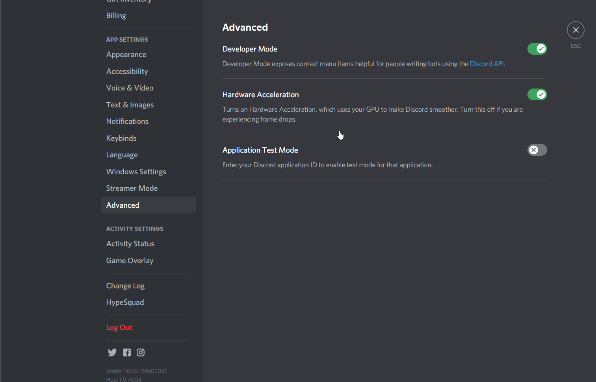

# Discord身分组管理


新版本改为使用指定的消息来管理 \
过去由HKTRPG增加信息，变相不能再修改内容，有点麻烦


让对指定消息的Reaction Emoji(如😀😃😄)进行点击的用家\
**分配指定的身分组别**

* 注意: 此功能需求HKTRPG拥有【编辑身分组】及【增加Reaction】的权限，请确定授权。
* 另外，用户需要【服务器管理者】权限。

### 使用教学

#### 开启**Developer Mode**

首先去**User Setting**=>**Advanced**=>开启**Developer Mode**\
这会令你可以COPY ID

#### **拷贝身分组ID**

再去**Server Setting**=>**Roles**=>**添加**或**设置**希望分配的**身分组**\
然后对该身分组按右键并按**COPY ID**，把该**ID**记下来

#### 发布信息及拷贝信息ID

接着，去任意频道中发布一段信息，表示如果按了React 就会得到身份组，\
并对该信息按右键再按COPY ID，把该ID记下

**范例** \
按🎨可得身分组-画家 \
按😁可得身分组-大笑

#### 输入指令

最后按以下格式来输入指令，把上面记下的ID，填进去

`.roleReact add`\
`身份组ID Emoji`\
`[[messageID]]`\
`发布消息的ID`

#### **范例**

`.roleReact add`\
`232312882291231263 🎨`\
`123123478897792323 😁`\
`[[messageID]]`\
`12312347889779233`


注意, 可以重复输入同样ID来增加新emoji


### 功能一覧

* `.roleReact add` 添加指定信息
* `.roleReact show` 显示现有的指定消息的数据
* `.roleReact delete 序号` 删除后该信息将不会再派发移除身分组

### FAQ

#### 问1: 我尝试把某身份组分配给人，但别人点击了Reaction 也没反应呢?

可能的原因很多，但主要是权限不足。\
Discord 有严格的权限保护，你可以尝试检查HKTRPG有没有管理Roles的权限，如果已经有或已经是Admin，\
那么接下来请查看希望分派的Role会不会在《Roles》里，位置比HKTRPG更高。\
在这情况里，即使HKTRPG拥有Admin权限，也会派发不了这Role给别人。\
你需要把HKTRPG调整到更它们更高的位置。

 
